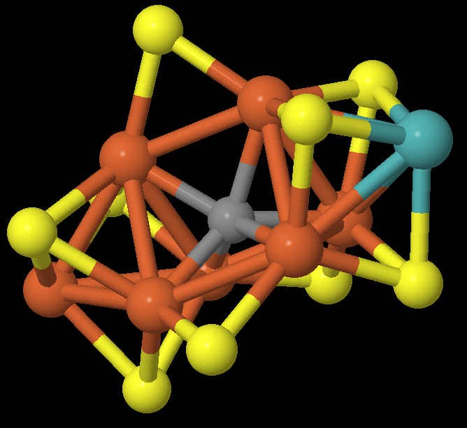

## Introduction

This post serves to aggregate what we learned from a three-month mentorship
hosted by the Quantum Open Software Foundation [^qosf], through interactions
with our mentor (Vesselin [^vesselin]) and the other mentees. We are forever
grateful for the time and energy they have donated, for which none of this would
have been possible.

During the mentorship, we investigated the viability of simulating
[FeMoco](https://en.wikipedia.org/wiki/FeMoco), a cluster of molecules in nitrogenase.  The cluster is
responsible for the nitrogenase enzyme's remarkable ability to catalyze nitrogen
fixation, so there is significant interest in accurately simulating this
molecule.  We've structured this post to target someone who has /some/
background in quantum computation and computational chemistry, but may not have
a full grasp of the process for performing this simulation, and what roadblocks
arise.  It is more of a pedagogical journey than a textbook -- you should feel
free to skip sections as needed.  So without further ado...

## Problem Overview

The purpose of this project was to calculate the ground state of various
derivatives of FeMoco, which is this molecule:



So what is this and why do we care? This is a cluster that appears in
nitrogenase, an enzyme responsible for converting gaseous nitrogen (N2) to
ammonia (NH3) in soil.  The ammonia is then used by plants to synthesize
chlorophyll. This process (called nitrogen fixation) is a major bottleneck for
plant growth, and therefore food production, and there are industrial processes
that attempt to mimic this.  The Haber-Bosch process subjects gaseous nitrogen
to high temperatures and pressures to break the triple-bond, and produces the
majority of the nitrogen supply available to plants today.  However, generating
this high-pressure environment is energy-expensive, and the Haber process
consumes about 1-2% of the world's energy production.  What's /not/ understood
is how nitrogenase can break the triple-bond of N2 at atmospheric temperatures
and pressures.

$$H_2$$

TODO testing mathjax

TODO add formula for Haber bosch TODO add formula for Femoco catalyzed nitrogen
fixation

This is the question: How does FeMoco *actually* catalyze nitrogen fixation, and
can we scale this process to replace Haber-Bosch?

## Background Info

To make this concrete -- we know that the reaction starts with N2 and FeMoco,
and somehow ends up producing NH3 and FeMoco:

TODO N2 + Femoco -> intermediates -> NH3 + Femoco image in Azobacter vinelandii

TODO We want to find what are the chemical intermediates TODO Eyring rate
equation TODO Energy spectrum TODO Lowest energy not necessarily ideal
(reference Ian Dance paper)

### Quantum Chemistry using Classical Computers

Simulating quantum mechanical systems, such as molecules, has been an important quest in the theoretical
chemistry community for some time, and numerous algorithms of different cost and
underlying theories are actively researched. For transition metal complexes, due
to their complexity, a common choice is to use DFT (density functional theory).
Starting from the many-body setup with multiple electrons, protons, and neutrons
interacting in the target system, DFT operates on the electron density as a
variable, reducing down some complexity of the problem. Based on this
background, DFT has some record of treating some moderately-sized molecules
chemists are interested in with reasonable cost and accuracy in predicting key
chemical properties.

Even with these simplifications, the entire FeMoco complex is quite difficult to
simulate with DFT using basis sets that are detailed enough, even with clever
choice of the functionals. Because our aim is to pedagogically explore the steps
as if we had the resources to complete the simulation on conventional and
quantum computers, the simple *(and fictitious)* complex of
Fe<sub>2</sub>S<sub>2</sub>, which comprises the core of FeMoco, was used as a
model system. Using Orca[^orca] and Avogadro[^avogadro], starting from initial
geometries deposited from crystallography, geometry optimization can be
performed using the functionals and basis sets (TPSSh and def2-TZVPP in our run)
and the frontier orbitals can be plotted. These simulations on a classical
computer provide us with a baseline of where things are before we explore the
quantum computing side of this tale.

"TODO Add diagrams/visuals from DFT run"

### The Variational Principle

Variational principle is the basic reasoning behind the Variational Quantum Eigensolver algorithm (hence its name). Used also in quantum chemical calculations on conventional computers, this principle simply allows us to establish some trial wavefunctions, and each and every trial wavefunctions should follow this relation: ***E<sub>0</sub> &leq; < &Psi; &vert; H &vert; &Psi; > / < &Psi; &vert; &Psi; >*** . Of course when ***&Psi;*** is exactly the solution of the Hamiltonian ***H***, the equality condition is met. By using the variational principle, we can think of the complicated Hamiltonian problem into a search for global minima of the system. 

### Variational Quantum Eigensolver

Starting from the variational principle, VQE (Variational Quantum Eigensolver) pretty simply follows. This algorithm starts from some choice of initial wavefunction ***&Psi;<sub>0</sub>*** . Then, on a quantum device, the expectation value of the energy using this wavefunction, namely ***<&Psi;<sub>0</sub>&vert;H&vert;&Psi;<sub>0</sub>>*** is evaluated. Back on the classical device, the wavefunction is updated and the expectation is calculated iteratively to achieve the global minima. If the global minimum is found, variational principle allows us to conclude that this is the ground state and the expectation that was evaluated is the ground state energy.

## Project Planning

TODO

1. Run SCF on FeMoco
2. Generate Hamiltonian
3. Run VQE on hamiltonian

## Extracting the Molecule / Defining the Fock Space

The first step in analyzing the molecule is, naturally, to find the geometry for
it. The first structural models appeared in 1978[^cramer], with the six-atom
iron cage discovered in 1992. In 2002, a central atom within the cage was
discovered, which was widely believed to be nitrogen. It wasn't until 2011 when
we'd have the correct stoichiometry, when the central atom was determined to be
carbon [^spatzal].

All of this is to say, a lot of the literature and geometries for FeMoco are
incorrect, and it's important to find a structure from after 2011. Our analysis
uses [3U7Q](https://www.rcsb.org/structure/3u7q), a protein sample from
nitrogenase in Azotobacter vinelandii. The 3D view confirms that this has the
correct FeMoco cluster, labeled ICS 6496.

TODO add image of ICS 6496


### Sidenote : Hartree-Fock vs. CASSCF

TODO

## Generating the Hamiltonian

This is the step that seemed easy at the outset of the project, but we
ultimately didn't give enough respect to -- most of the three months were spent
here.  The path for setting up VQE involves:

1. Calculating the one-and-two body integrals for the second quantized
electronic Hamiltonian
2. Constructing a fermionic operator
3. Converting the fermionic operator into a qubit operator

The problem is that the two-body term in the electronic Hamiltonian is a
4-tensor over the number of orbitals in the Fock space, which scales as O(N^4)
(where N is the number of spin-orbitals).  A molecule such as FeMoco, with ~200
orbitals, will have 400 spin-orbitals, meaning the two-body tensor will have
25,600,000,000 elements.  If we store each element as a 64-bit floating point (8
bytes), simply storing the matrix will cost 204,800,000,000 bytes = 204 GiB.
This is also too large to store in RAM, so mathematical operations on it become
expensive.

There are a few simplifications we can make.  The first one we tried was using
32-bit floating points instead of 64-bit, which should halve the storage
requirements to ~100 GiB.  However, the biggest simplification involved freezing
and removing irrelevant orbitals.

A converged ROHF run on FeMoco yields the following orbitals:

```
TODO orbital energies
```

This result was gathered by using PySCF's
[`scf.analyze()`](https://sunqm.github.io/pyscf/scf.html#pyscf.scf.hf.SCF.analyze).
The assumption is that electrons in the low-energy orbitals will effectively
never leave -- hence, their effect on the dynamics of the rest of the structure
can be represented as a static electric potential.  Similarly, the high-energy
orbitals are unlikely to be filled, and can be removed.

It is not clear to us how one can safely determine how many orbitals can be
frozen or removed.  We more or less arbitrarily chose to freeze orbitals 1-184,
and remove orbitals 190-239, leaving an active space of 6 orbitals.  This is
almost certainly too severe of an approximation, but the priority was to
generate the minimum-viable VQE circuit, and then slowly relax the
optimizations.  All of the orbitals above #58 or so are nearly degenerate in
energy, so a proper analysis will likely need to include them in the active
space.

Once we have the reduced active space, we can choose a proper mapping
(Bravyi-Kitaev or Jordan-Wigner) to generate a qubit operator, and then the
corresponding VQE circuit.  Unfortunately, the freezing and removal steps are
themselves non-trivial due to the memory requirements mentioned above, and
require a proper analysis.

## Details on Qiskit / PySCF libraries

In Qiskit-Aqua 0.8.1, freezing and reduction of orbitals is performed by the
[FermionicTransformation](https://qiskit.org/documentation/stubs/qiskit.chemistry.transformations.FermionicTransformation.html) class.

```
class FermionicTransformation(
    transformation=<FermionicTransformationType.FULL: 'full'>,
    qubit_mapping=<FermionicQubitMappingType.PARITY: 'parity'>,
    two_qubit_reduction=True,
    freeze_core=False,
    orbital_reduction=None,
    z2symmetry_reduction=None):

    A transformation from a fermionic problem, represented by a driver, to a qubit operator.
```

The `orbital_reduction` parameter can be used to specify which orbitals to
freeze/remove.  The user then calls
[`.transform(driver)`](https://qiskit.org/documentation/stubs/qiskit.chemistry.transformations.FermionicTransformation.html#qiskit.chemistry.transformations.FermionicTransformation.transform) to 
generate the qubit operator.

If we use this straight with our molecule, we run into memory allocation errors.
So let us look at the implementation of this function to see where we can
reduce the memory requirements.

The
[`FermionicTransformation()`](https://qiskit.org/documentation/_modules/qiskit/chemistry/transformations/fermionic_transformation.html#FermionicTransformation.__init__) constructor itself is
uninteresting, as it only assigns parameters.  The meat of the function happens
in
[`.transform()`](https://qiskit.org/documentation/_modules/qiskit/chemistry/transformations/fermionic_transformation.html#FermionicTransformation.transform):

```py
def transform(self, driver: BaseDriver,
                  aux_operators: Optional[List[FermionicOperator]] = None
                  ) -> Tuple[OperatorBase, List[OperatorBase]]:
        ...
        q_molecule = driver.run()
        ops, aux_ops = self._do_transform(q_molecule, aux_operators)

        ...
        return ops, aux_ops
```

This calls `driver.run()` (which is PySCF's `.kernel()`) and then passes the
result to `self._do_transform()`:

```
 def _do_transform(self, qmolecule: QMolecule,
                      aux_operators: Optional[List[FermionicOperator]] = None
                      ) -> Tuple[WeightedPauliOperator, List[WeightedPauliOperator]]:

        ...
        # In the combined list any orbitals that are occupied are added to a freeze list and an
        # energy is stored from these orbitals to be added later.
        # Unoccupied orbitals are just discarded.
        ...

        # construct the fermionic operator
        fer_op = FermionicOperator(h1=qmolecule.one_body_integrals, h2=qmolecule.two_body_integrals)

        # try to reduce it according to the freeze and remove list
        fer_op, self._energy_shift, did_shift = \
            FermionicTransformation._try_reduce_fermionic_operator(fer_op, freeze_list, remove_list)

        ...
```

Here we run into the first computational bottleneck.
[`qmolecule.two_body_integrals`](https://qiskit.org/documentation/_modules/qiskit/chemistry/qmolecule.html#QMolecule) is actually not a variable; it's a method defined as such:

```py
 @property
    def two_body_integrals(self):
        """ Returns two body electron integrals. """
        return QMolecule.twoe_to_spin(self.mo_eri_ints, self.mo_eri_ints_bb, self.mo_eri_ints_ba)
```

`self.mo_eri_ints`, `self.mo_eri_ints_bb`, and `self.mo_eri_ints_ba` are `(N, N,
N, N)`-dimensional numpy arrays representing the two-body tensor, where N is the
number of spatial orbitals.  Each matrix represents a subsection of the full
spin-orbital Fock space, in this way:

```
TODO better diagram

       alpha              beta
       ----------------> ---------------->
     | -----------------------------------
  a  | |                |                |
  l  | |                |                |
  p  | | mo_eri_ints    | mo_eri_ints_ba |
  h  | |                |                |
  a  v |                |                |
       -----------------------------------
  b  | |                |                |
  e  | |                |                |
  t  | | mo_eri_ints_ab | mo_eri_ints_bb |   (where mo_eri_ints_ab = mo_eri_ints_ba.transpose() )
  a  | |                |                |
     v |                |                |
       -----------------------------------
```

`twoe_to_spin()` aggregates the spatial matrix into one large spin-orbital
matrix, but in doing so doubles each of the 4 dimensions, resulting in a
16-fold increase in memory requirements.  This can be seen in the source for
[`twoe_to_spin()`](https://qiskit.org/documentation/_modules/qiskit/chemistry/qmolecule.html#QMolecule.twoe_to_spin):

```py
 def twoe_to_spin(mohijkl, mohijkl_bb=None, mohijkl_ba=None, threshold=1E-12):
        """Convert two-body MO integrals to spin orbital basis

        Takes two body integrals in molecular orbital basis and returns
        integrals in spin orbitals ready for use as coefficients to
        two body terms in 2nd quantized Hamiltonian.

        Args:
            mohijkl (numpy.ndarray): Two body orbitals in molecular basis
(AlphaAlpha)
            mohijkl_bb (numpy.ndarray): Two body orbitals in molecular basis
(BetaBeta)
            mohijkl_ba (numpy.ndarray): Two body orbitals in molecular basis
(BetaAlpha)
            threshold (float): Threshold value for assignments
        Returns:
            numpy.ndarray: Two body integrals in spin orbitals
        """
        ints_aa = numpy.einsum('ijkl->ljik', mohijkl)

        if mohijkl_bb is None or mohijkl_ba is None:
            ints_bb = ints_ba = ints_ab = ints_aa
        else:
            ints_bb = numpy.einsum('ijkl->ljik', mohijkl_bb)
            ints_ba = numpy.einsum('ijkl->ljik', mohijkl_ba)
            ints_ab = numpy.einsum('ijkl->ljik', mohijkl_ba.transpose())

        # The number of spin orbitals is twice the number of orbitals
        norbs = mohijkl.shape[0]
        nspin_orbs = 2*norbs

        # The spin orbitals are mapped in the following way:
        #       Orbital zero, spin up mapped to qubit 0
        #       Orbital one,  spin up mapped to qubit 1
        #       Orbital two,  spin up mapped to qubit 2
        #            .
        #            .
        #       Orbital zero, spin down mapped to qubit norbs
        #       Orbital one,  spin down mapped to qubit norbs+1
        #            .
        #            .
        #            .

        # Two electron terms
        moh2_qubit = numpy.zeros([nspin_orbs, nspin_orbs, nspin_orbs,
nspin_orbs])
        for p in range(nspin_orbs):  # pylint: disable=invalid-name
            for q in range(nspin_orbs):
                for r in range(nspin_orbs):
                    for s in range(nspin_orbs):  # pylint: disable=invalid-name
                        spinp = int(p/norbs)
                        spinq = int(q/norbs)
                        spinr = int(r/norbs)
                        spins = int(s/norbs)
                        if spinp != spins:
                            continue
                        if spinq != spinr:
                            continue
                        if spinp == 0:
                            ints = ints_aa if spinq == 0 else ints_ba
                        else:
                            ints = ints_ab if spinq == 0 else ints_bb
                        orbp = int(p % norbs)
                        orbq = int(q % norbs)
                        orbr = int(r % norbs)
                        orbs = int(s % norbs)
                        if abs(ints[orbp, orbq, orbr, orbs]) > threshold:
                            moh2_qubit[p, q, r, s] = -0.5*ints[orbp, orbq, orbr,
orbs]

        return moh2_qubit

```

The full spin-orbital array is allocated in this line:

```
moh2_qubit = numpy.zeros([nspin_orbs, nspin_orbs, nspin_orbs, nspin_orbs])
```

and each value in the `(2N, 2N, 2N, 2N)`-dimensional array is computed and
stored.  This upfront performance penalty is superfluous with our use case, where
most of the orbitals will be removed.  Additionally, numpy arrays generally
don't want to be iterated over with Python loops -- their performance benefits
come from looping at the C level, where the reduced overhead leads to more
frequent cache hits.  The current implementation does have some benefits, as it
prevents having to allocate large mesh grids and is much easier to read than
fully vectorized code.  More on this later.

The second performance bottleneck comes from the `_try_reduce_fermionic_operator()`
call, which performs the actual freezing/removal:

```
def _try_reduce_fermionic_operator(fer_op: FermionicOperator,
                                       freeze_list: List,
                                       remove_list: List) -> Tuple:
        """
        Trying to reduce the fermionic operator w.r.t to freeze and remove list
if provided

        Args:
            fer_op: fermionic operator
            freeze_list: freeze list of orbitals
            remove_list: remove list of orbitals

        Returns:
            (fermionic_operator, energy_shift, did_shift)
        """
        # pylint: disable=len-as-condition
        did_shift = False
        energy_shift = 0.0
        if len(freeze_list) > 0:
            fer_op, energy_shift = fer_op.fermion_mode_freezing(freeze_list)
            did_shift = True
        if len(remove_list) > 0:
            fer_op = fer_op.fermion_mode_elimination(remove_list)
        return fer_op, energy_shift, did_shift
```

This simply runs
[`fermion_mode_freezing()`](https://qiskit.org/documentation/_modules/qiskit/chemistry/fermionic_operator.html#FermionicOperator.fermion_mode_freezing)
and [`fermion_mode_elimination()`](https://qiskit.org/documentation/_modules/qiskit/chemistry/fermionic_operator.html#FermionicOperator.fermion_mode_elimination)
one after the other.  The code gets pretty hard to follow here; we'll attempt to
describe the operations diagrammatically:

TODO h2.png

First, `twoe_to_spin()` combines the four sub-integrals (`mo_eri_ints` and
variants) into a single large 4-tensor (the diagram is 2-dimensional, but is
intended to represent a 4-dimensional cube of sorts).  Some orbitals (in red)
are simply deleted.  The rest of the elements are handled as follows:

TODO h2_frozen.png


## Further Work

Although our approach to this problem has been largely pedagogical, it reveals where future works on the topic can be directed towards. Without major improvements in the quantum hardware, treating the full space of transition metal complexes will remain a very difficult task.

 - Effective treatment of core freezing and removal of virtual orbital in Hamiltonian construction
 - Comprehensive study of the portability of Hamiltonian reduction mechanisms used in conventional computers to quantum computer based algorithms (i.e. ECPs, pseudopotentials)

TODO: expand more

## Useful Papers

TODO


## Footnotes

[^qosf]: <https://qosf.org/qc_mentorship/>
[^vesselin]: <TODO>
[^spatzal]: <https://science.sciencemag.org/content/334/6058/940>
[^cramer]: . Cramer SP, Hodgson KO, Gillum WO, Mortenson LE. J Am Chem Soc.
[^bjornsson]: 1978;100:3398–3407. Bjornsson R, Neese F, Schrock RR, Einsle O,
DeBeer S. The discovery of Mo(III) in FeMoco: reuniting enzyme and model
chemistry. J Biol Inorg Chem. 2015;20(2):447-460. doi:10.1007/s00775-014-1230-6
[^orca]: <https://orcaforum.kofo.mpg.de/>
[^avogadro]: <https://avogadro.cc/>
