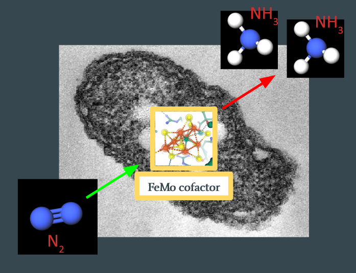
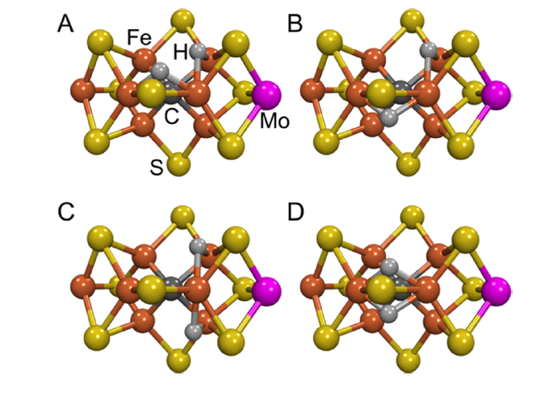
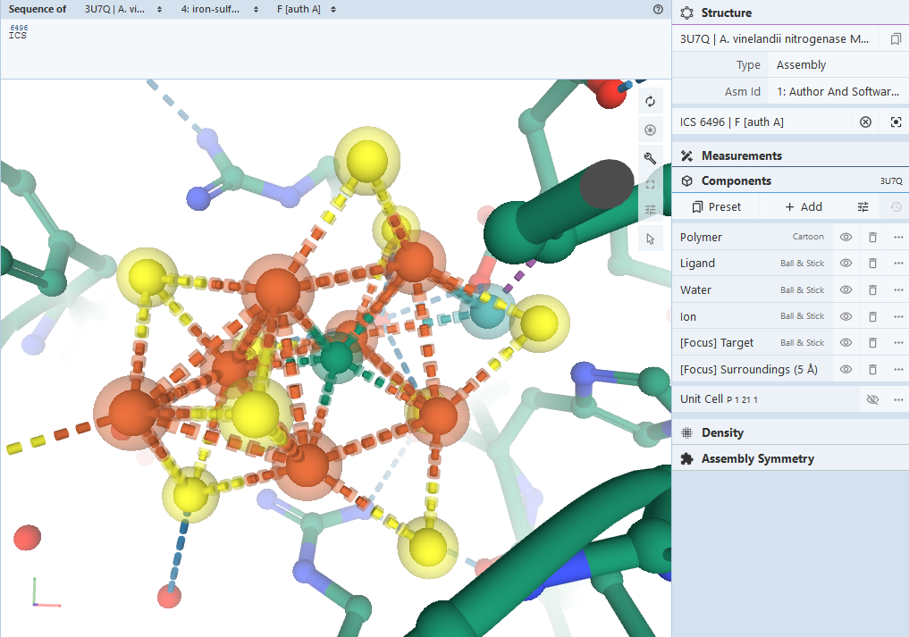
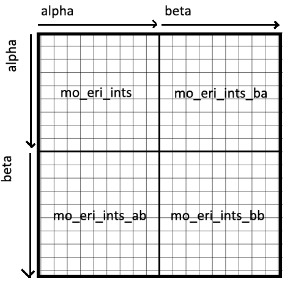
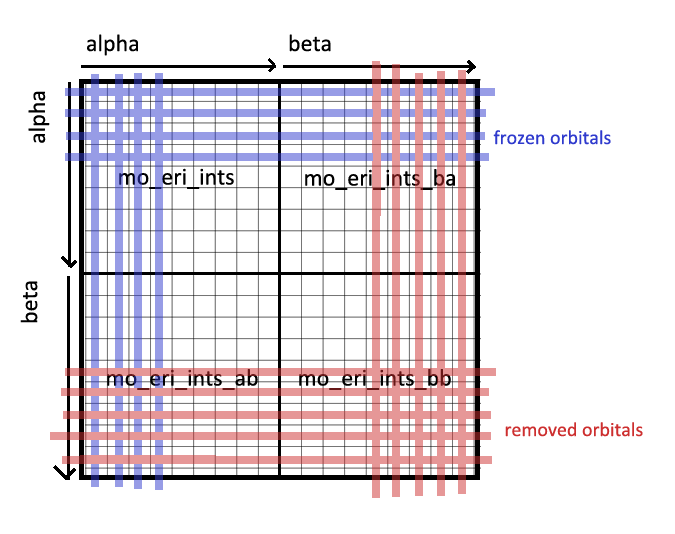
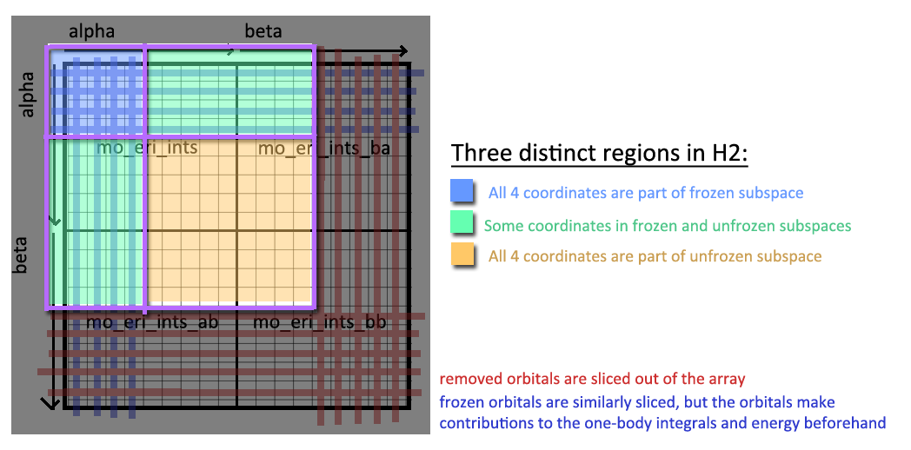

# Applying the Variational Quantum Eigensolver to the FeMo cofactor of nitrogenase

## Introduction

This post serves to aggregate what we learned from a three-month mentorship
hosted by the Quantum Open Software Foundation [^qosf], through interactions
with our mentor (Vesselin [^vesselin]) and the other mentees. We are forever
grateful for the time and energy they have donated, for which none of this would
have been possible.

During the mentorship, we investigated the viability of simulating
[FeMoco](https://en.wikipedia.org/wiki/FeMoco), a cluster of molecules in nitrogenase.  The cluster is
responsible for the nitrogenase enzyme's remarkable ability to catalyze nitrogen
fixation, so there is significant interest in accurately simulating this
molecule.  We've structured this post to target someone who has *some*
background in quantum computation and computational chemistry, but may not have
a full grasp of the process for performing this simulation, and what roadblocks
arise.  It is more of a pedagogical journey than a textbook -- you should feel
free to skip sections as needed.  So without further ado...

## Problem Overview

The purpose of this project was to calculate the ground state of various
derivatives of FeMoco, which is this molecule:


So what is this and why do we care? This is a cluster that appears in
nitrogenase, an enzyme responsible for converting gaseous nitrogen ($$\ce{N2}$$) to
ammonia ($$\ce{NH3}$$) in soil.  The ammonia is then used by plants to synthesize
chlorophyll. This process (called nitrogen fixation) is a major bottleneck for
plant growth, and therefore food production, and there are industrial processes
that attempt to mimic this.  The Haber-Bosch process subjects gaseous nitrogen
to high temperatures and pressures to break the triple-bond, and produces the
majority of the nitrogen supply available to plants today.  However, generating
this high-pressure environment is energy-expensive, and the Haber process
consumes about 1-2% of the world's energy production.  What's *not* understood
is how nitrogenase can break the triple-bond of $$\ce{N2}$$ at atmospheric temperatures
and pressures.

This is the question: How does FeMoco *actually* catalyze nitrogen fixation, and
can we scale this process to replace Haber-Bosch?

---

$$\ce{N2 + 3H2 -> 2NH3} \tag{1}\label{1}$$

$$\ce{N2 + 16ATP + 8e- + 8H+ -> 2NH3 + H2 + 16ADP + 16} \tag{2}\label{2}$$

`Ref: The Haber process (1) vs. nitrogenase-catalyzed nitrogen fixation (2)`


## Background Info

### Determining the Likelihood of Chemical Reaction Pathways

To make this concrete -- we know that the reaction starts with $$\ce{N2}$$ binding
with FeMoco, somewhere on the substrate, *some* process occurs, and $$\ce{NH3}$$
leaves, with FeMoco itself unmodified:



The goal is to figure out what happens in between. In particular, we expect
several stable intermediates, $$x_n$$, to form during the reaction:

$$\ce{N2 -> x1 -> x2 -> ... -> NH3}$$

Each intermediate will have some ground state energy, $$E(x_n)$$.  The
differences between the ground states, $$\Delta H(x_n) = E(x_n) -
E(x_{n-1})$$, determine the rate of the reaction by the Eyring rate equation:

$$k = \frac{\kappa k_\mathrm{B}T}{h} \mathrm{e}^{\frac{\Delta S^\ddagger}{R}} \mathrm{e}^{-\frac{\Delta H^\ddagger}{RT}}$$

Note that this rate is proportional to $$\exp(-\Delta H / RT)$$, so large jumps
in energy get exponentially punished.  Additionally, energy values for FeMoco
live on the order of 10,000 hartrees ([^montgomery]), so to achieve chemical
accuracy (errors under 1 millihartree) require 7-8 significant figures of
precision.  This precision requirement is what we need to overcome in order to
properly assess the likelihood of nitrogenase reactions.

One final note -- it is not necessarily true that intermediates involving low
energy states will be more likely.  See the following quote from (Dance, 2019)[^dance]:

```
An implicit assumption of theoretical calculations is that the structure with lowest calculated energy
is the most likely to occur. Thus, in searches for intermediates in the nitrogenase mechanism, the
lowest energy structure found for each composition is often accepted as such. This targeting of the
lowest energy calculated structures has led some investigators into unusual domains of chemical
mechanism. This could be insightful, particularly for the complexities of catalysis at FeMo-co, but
it could also be misleading. A lowest energy structure could be a deep thermodynamic sink for that
composition, and therefore to be avoided because a general tenet of catalysis is avoidance of
unescapable thermodynamic sinks. The broad objective is to find an energy surface that is
relatively flat and trends downhill, keeping away from highs (kinetic barriers) and lows (dead ends).
```

### A Schematic for the $$\ce{N2 -> NH3}$$ Reaction: The Thorneley-Lowe Model

Experimental studies on the reaction mechanism have not been able to isolate any
intermediates.  However, kinetic measurements on FeMoco provide a schematic for
what a reaction pathway must look like.  The Thorneley-Lowe model was first
published in 1984[^lowe], and a simplified version is shown below:[^lowe]


** Ref: By Mlk803 - Chemdraw, CC BY-SA 4.0 **
[^mlk]

FeMoco ($$\ce{Fe7MoS9C}$$) starts as $$E_0$$.  It collects four electrons and
four protons before reaching the $$E_4$$ state (also called the "Janus" state).
The general consensus is that these electrons and protons exist as bridging
hydrides between two $$\ce{Fe}$$ atoms (see the diagram below[^hoffman2014] for
four such candidate states):



The remainder of the reaction remains largely unknown, but diverge into either
"distal" or "alternating" pathways (see Hoffman, 2014 [^hoffman2014] for more
information).

### Candidate Reaction Mechanisms

In light of the Thorneley-Lowe kinetic model, several candidate reaction
mechanisms exist that fit this description.  They are described in detail in
Dance, 2019 [^dance]. They are outside of the scope of our understanding, but a
major goal of this project will eventually be to calculate energies of some of the
intermediates of these reaction pathways.  Further work needs to be done.

### Quantum Chemistry using Classical Computers

Simulating quantum mechanical systems, such as molecules, has been an important quest in the theoretical
chemistry community for some time, and numerous algorithms of different cost and
underlying theories are actively researched. For transition metal complexes, due
to their complexity, a common choice is to use DFT (density functional theory).
Starting from the many-body setup with multiple electrons, protons, and neutrons
interacting in the target system, DFT operates on the electron density as a
variable, reducing down some complexity of the problem. Based on this
background, DFT has some record of treating some moderately-sized molecules
chemists are interested in with reasonable cost and accuracy in predicting key
chemical properties.

Even with these simplifications, the entire FeMoco complex is quite difficult to
simulate with DFT using basis sets that are detailed enough, even with clever
choice of the functionals. Because our aim is to pedagogically explore the steps
as if we had the resources to complete the simulation on conventional and
quantum computers, the simple *(and fictitious)* complex of
$$\ce{Fe2S2}$$, which comprises the core of FeMoco, was used as a
model system. Using Orca[^orca] and Avogadro[^avogadro], starting from initial
geometries deposited from crystallography, geometry optimization can be
performed using the functionals and basis sets (TPSSh and def2-TZVPP in our run)
and the frontier orbitals can be plotted. These simulations on a classical
computer provide us with a baseline of where things are before we explore the
quantum computing side of this tale.

"TODO Add diagrams/visuals from DFT run"

### The Variational Principle

Variational principle is the basic reasoning behind the Variational Quantum Eigensolver algorithm (hence its name). Used also in quantum chemical calculations on conventional computers, this principle simply allows us to establish some trial wavefunctions, and each and every trial wavefunctions should follow this relation:

$$E_0 \leq \frac{\bra{\Psi} H \ket{\Psi}}{\braket{\Psi \vert \Psi} }$$

Of course, when $$\Psi$$ is exactly the solution of the Hamiltonian $$H$$, the equality condition is met. By using the variational principle, we can think of the complicated Hamiltonian problem into a search for global minima of the system. 

### Variational Quantum Eigensolver

Starting from the variational principle, VQE (Variational Quantum Eigensolver) pretty simply follows. This algorithm starts from some choice of initial wavefunction $$\Psi_0$$ . Then, on a quantum device, the expectation value of the energy using this wavefunction, namely $$\bra{\Psi_0} H \ket{\Psi_0}$$ is evaluated. Back on the classical device, the wavefunction is updated and the expectation is calculated iteratively to achieve the global minima. If the global minimum is found, variational principle allows us to conclude that this is the ground state and the expectation that was evaluated is the ground state energy.

## Project Outline

Above, we provide the essential background information to understand the problem
of finding reaction mechanisms for FeMoco-catalyzed nitrogen fixation, as well
as what we know from classical chemistry techniques.  The aim of this project is
applying the variational quantum eigensolver to FeMoco intermediates, in order
to calculate the ground state energies to millihartree accuracy.  Our strategy
for this is outlined below:

1. First, run SCF on the simplest FeMoco state, $$E_0 = \ce{Fe7MoS9C}$$.
2. Generate the fermionic operator for the second-order electronic Hamiltonian
   of the result.
3. Freeze and reduce certain orbitals, to reduce calculational load.
4. Use a qubit mapping (Bravyi-Kitaev or Jordan-Wigner) to map the fermionic
   operator to a qubit operator.
5. Convert the qubit operator into a VQE circuit, to be run on NISQ devices.

As of the time of this writing, we were able to complete Step 1 (using an STO-3G
basis), and made progress on Steps 2-3 (described below).  Steps 4-5 remain as
future work.

The remainder of this post describes progress made for Steps 1-3.

### Extracting the Molecule / Defining the Fock Space

The first step in analyzing the molecule is, naturally, to find the geometry for
it. The first structural models appeared in 1978[^cramer], with the six-atom
iron cage discovered in 1992. In 2002, a central atom within the cage was
discovered, which was widely believed to be nitrogen. It wasn't until 2011 when
we'd have the correct stoichiometry, when the central atom was determined to be
carbon [^spatzal].

All of this is to say, a lot of the literature and geometries for FeMoco are
incorrect, and it's important to find a structure from after 2011. Our analysis
uses [3U7Q](https://www.rcsb.org/structure/3u7q), a protein sample from
nitrogenase in Azotobacter vinelandii. The 3D view confirms that this has the
correct FeMoco cluster, labeled ICS 6496.



We extract the geometry of this cluster as [molecules/ICS.xyz](https://github.com/roytu/QOSF-FeMoco2020/blob/main/molecules/ICS.xyz), and run an ROHF calculation using PySCF, using STO-3G and iterating until convergence:

```
driver = PySCFDriver(atom=convert_g_to_str(g),
                     unit=UnitsType.ANGSTROM,
                     charge=-1,
                     spin=3,
                     max_cycle=5000,
                     max_memory=1024 * 128,
                     basis='sto3g'
                     )
molecule = driver.run()
```

The charge and spin values were determined from the literature: it is believed
that FeMoco has charge/spin values ($$Q = 1$$ and $$S = 3/2$$).

You may notice that a few optimizations are made here:

* ROHF (or Restricted Open Hartree-Fock) restricts the wave function to be a
single Slater determinant.  This is very unlikely to properly describe 
transition metal complexes such as FeMoco.  Post-Hartree Fock techniques such as
CASSCF or MRCI should be considered.
* STO-3G is a basis that approximates each Slater-type orbitals as a sum of
  three Gaussians.  This drastically speeds up calculations at the expense of
accuracy.  More accurate basis sets (such as 6-31G) should be considered.

These are very real issues, and further work needs to be done to address this
before the results can be taken seriously.  Nevertheless, we were able to
successfully run an ROHF procedure on FeMoco, saved as an `.hdf5` file.
Unfortunately, this file was too large to store in GitHub (~52 GiB).  Feel free
to contact us if you would like the file (although we suggest generating the
file yourself -- on a consumer-grade laptop the calculation took about 2
hours).

### Generating the Hamiltonian

This is the step that seemed easy at the outset of the project, but we
ultimately didn't give enough respect to -- most of the three months were spent
here.  The path for setting up VQE involves:

1. Calculating the one-and-two body integrals for the second quantized
electronic Hamiltonian
2. Constructing a fermionic operator
3. Converting the fermionic operator into a qubit operator

The problem is that the two-body term in the electronic Hamiltonian is a
4-tensor over the number of orbitals in the Fock space, which scales as O(N^4)
(where N is the number of spin-orbitals).  A molecule such as FeMoco, with ~200
orbitals, will have 400 spin-orbitals, meaning the two-body tensor will have
25,600,000,000 elements.  If we store each element as a 64-bit floating point (8
bytes), simply storing the matrix will cost 204,800,000,000 bytes = 204 GiB.
This is also too large to store in RAM, so mathematical operations on it become
expensive.

There are a few simplifications we can make.  The first one we tried was using
32-bit floating points instead of 64-bit, which should halve the storage
requirements to ~100 GiB.  However, the biggest simplification involved freezing
and removing irrelevant orbitals.

A converged ROHF run on FeMoco yields the orbitals in [src/rohf_results.txt#L126-L365](src/rohf_results.txt#L126-L365).
Some values are reproduced here (with specific interest around the HOMO/LUMO
boundary):

```
                Roothaan           | alpha              | beta
MO #1   energy= -708.903766153917  | -708.903798633962  | -708.903733673875   occ= 2
MO #2   energy= -264.444446482055  | -264.444517818457  | -264.444375145662   occ= 2
MO #3   energy= -264.345016784318  | -264.345054607994  | -264.34497896065    occ= 2
...
MO #183 energy= 1.09643727514943   | 1.09558247583117   | 1.09663379258447    occ= 2
MO #184 energy= 1.15899025544687   | 1.15743714310722   | 1.15858062143838    occ= 2
MO #185 energy= 1.16711246404398   | 1.16589429999198   | 1.16715896522943    occ= 2
MO #186 energy= 1.18261936022277   | 1.18129808152053   | 1.18212176959158    occ= 2
MO #187 energy= 1.22330320933397   | 1.22199801236922   | 1.22299501002836    occ= 1
MO #188 energy= 1.2363202894716    | 1.2343849951031    | 1.23544238639598    occ= 1
MO #189 energy= 1.27706096612159   | 1.27667030808647   | 1.27735609940753    occ= 1
MO #190 energy= 1.28677784728558   | 1.28619467360563   | 1.28681502511622    occ= 0
MO #191 energy= 1.3421113567691    | 1.34116138068155   | 1.34187377923942    occ= 0
MO #192 energy= 1.55165055468357   | 1.54823509661363   | 1.55081906199025    occ= 0
MO #193 energy= 1.59990426957057   | 1.59727631058337   | 1.59942425523402    occ= 0
...
MO #237 energy= 3.94769134513469   | 3.94634168140072   | 3.94713711612319    occ= 0
MO #238 energy= 3.95741060995661   | 3.95576782201872   | 3.95676428607888    occ= 0
MO #239 energy= 4.11279420713629   | 4.11191594660041   | 4.11296781936671    occ= 0
```

This result was gathered by using PySCF's
[`scf.analyze()`](https://sunqm.github.io/pyscf/scf.html#pyscf.scf.hf.SCF.analyze).
The assumption is that electrons in the low-energy orbitals will effectively
never leave -- hence, their effect on the dynamics of the rest of the structure
can be represented as a static electric potential.  Similarly, the high-energy
orbitals are unlikely to be filled, and can be removed.

It is not clear to us how one can safely determine how many orbitals can be
frozen or removed.  We more or less arbitrarily chose to freeze orbitals 1-184,
and remove orbitals 190-239, leaving an active space of 6 orbitals.  This is
almost certainly too severe of an approximation, but the priority was to
generate the minimum-viable VQE circuit, and then slowly relax the
optimizations.  All of the orbitals above #58 or so are nearly degenerate in
energy, so a proper analysis will likely need to include them in the active
space.

Once we have the reduced active space, we can choose a proper mapping
(Bravyi-Kitaev or Jordan-Wigner) to generate a qubit operator, and then the
corresponding VQE circuit.  Unfortunately, the freezing and removal steps are
themselves non-trivial due to the memory requirements mentioned above, and
require a proper analysis.

### Memory Hacks to Handle Large Calculations

During the mentorship program, we considered several options for running the
code.  One option was to create a memory-optimized [EC2
instance](https://aws.amazon.com/ec2/pricing/on-demand/).  An `r5.16xlarge`
instance boasts 512 GiB of RAM, with 64 vCPUs.  Unfortunately, these get
expensive fast (an `r5.16xlarge` instance currently runs for $4.032/hr).
Smaller instances are not much more cost-efficient.

Several online services exist for running code (such as Google's [Colab](https://colab.research.google.com/) and
IBM's [Quantum Experience](https://quantum-computing.ibm.com/)), but none of
these could gracefully handle the large memory allocations required.

Our solution was to set up a new Ubuntu machine with a 500 GiB SSD drive, and
create a 200 GiB swap file to simulate virtual memory.  This worked surprisingly
well, with most calculations either finishing (or crashing) after only 2 hours.
We were able to do this on a consumer-grade laptop (HP Envy m6).

This is the script for generating the swap file (adapted from this [AskUbuntu
post](https://askubuntu.com/posts/1075516/revisions)):

```
sudo swapoff /swapfile
sudo rm  /swapfile
sudo dd if=/dev/zero of=/swapfile bs=1M count=204800  # 200 GiB
sudo chmod 600 /swapfile
sudo mkswap /swapfile
sudo swapon /swapfile
```

The actual laptop has only 8 GiB of RAM, but augmented with the swap file, we
were able to perform calculations that required ~150 GiB of memory (as evaluated
by monitoring `htop` output throughout the runs).


### Details on Qiskit / PySCF libraries

In Qiskit-Aqua 0.8.1, freezing and reduction of orbitals is performed by the
[FermionicTransformation](https://qiskit.org/documentation/stubs/qiskit.chemistry.transformations.FermionicTransformation.html) class.

```
class FermionicTransformation(
    transformation=<FermionicTransformationType.FULL: 'full'>,
    qubit_mapping=<FermionicQubitMappingType.PARITY: 'parity'>,
    two_qubit_reduction=True,
    freeze_core=False,
    orbital_reduction=None,
    z2symmetry_reduction=None):

    A transformation from a fermionic problem, represented by a driver, to a qubit operator.
```

The `orbital_reduction` parameter can be used to specify which orbitals to
freeze/remove.  The user then calls
[`.transform(driver)`](https://qiskit.org/documentation/stubs/qiskit.chemistry.transformations.FermionicTransformation.html#qiskit.chemistry.transformations.FermionicTransformation.transform) to 
generate the qubit operator.

If we use this straight with our molecule, we run into memory allocation errors.
So let us look at the implementation of this function to see where we can
reduce the memory requirements.

The
[`FermionicTransformation()`](https://qiskit.org/documentation/_modules/qiskit/chemistry/transformations/fermionic_transformation.html#FermionicTransformation.__init__) constructor itself is
uninteresting, as it only assigns parameters.  The meat of the function happens
in
[`.transform()`](https://qiskit.org/documentation/_modules/qiskit/chemistry/transformations/fermionic_transformation.html#FermionicTransformation.transform):

```py
def transform(self, driver: BaseDriver,
                  aux_operators: Optional[List[FermionicOperator]] = None
                  ) -> Tuple[OperatorBase, List[OperatorBase]]:
        ...
        q_molecule = driver.run()
        ops, aux_ops = self._do_transform(q_molecule, aux_operators)

        ...
        return ops, aux_ops
```

This calls `driver.run()` (which is PySCF's `.kernel()`) and then passes the
result to `self._do_transform()`:

```
 def _do_transform(self, qmolecule: QMolecule,
                      aux_operators: Optional[List[FermionicOperator]] = None
                      ) -> Tuple[WeightedPauliOperator, List[WeightedPauliOperator]]:

        ...
        # In the combined list any orbitals that are occupied are added to a freeze list and an
        # energy is stored from these orbitals to be added later.
        # Unoccupied orbitals are just discarded.
        ...

        # construct the fermionic operator
        fer_op = FermionicOperator(h1=qmolecule.one_body_integrals, h2=qmolecule.two_body_integrals)

        # try to reduce it according to the freeze and remove list
        fer_op, self._energy_shift, did_shift = \
            FermionicTransformation._try_reduce_fermionic_operator(fer_op, freeze_list, remove_list)

        ...
```

Here we run into the first computational bottleneck.
[`qmolecule.two_body_integrals`](https://qiskit.org/documentation/_modules/qiskit/chemistry/qmolecule.html#QMolecule) is actually not a variable; it's a method defined as such:

```py
 @property
    def two_body_integrals(self):
        """ Returns two body electron integrals. """
        return QMolecule.twoe_to_spin(self.mo_eri_ints, self.mo_eri_ints_bb, self.mo_eri_ints_ba)
```

`self.mo_eri_ints`, `self.mo_eri_ints_bb`, and `self.mo_eri_ints_ba` are `(N, N,
N, N)`-dimensional numpy arrays representing the two-body tensor, where N is the
number of spatial orbitals.  Each matrix represents a subsection of the full
spin-orbital Fock space, in this way:



`twoe_to_spin()` aggregates the spatial matrix into one large spin-orbital
matrix, but in doing so doubles each of the 4 dimensions, resulting in a
16-fold increase in memory requirements.  This can be seen in the source for
[`twoe_to_spin()`](https://qiskit.org/documentation/_modules/qiskit/chemistry/qmolecule.html#QMolecule.twoe_to_spin):

```py
 def twoe_to_spin(mohijkl, mohijkl_bb=None, mohijkl_ba=None, threshold=1E-12):
        """Convert two-body MO integrals to spin orbital basis

        Takes two body integrals in molecular orbital basis and returns
        integrals in spin orbitals ready for use as coefficients to
        two body terms in 2nd quantized Hamiltonian.

        Args:
            mohijkl (numpy.ndarray): Two body orbitals in molecular basis
(AlphaAlpha)
            mohijkl_bb (numpy.ndarray): Two body orbitals in molecular basis
(BetaBeta)
            mohijkl_ba (numpy.ndarray): Two body orbitals in molecular basis
(BetaAlpha)
            threshold (float): Threshold value for assignments
        Returns:
            numpy.ndarray: Two body integrals in spin orbitals
        """
        ints_aa = numpy.einsum('ijkl->ljik', mohijkl)

        if mohijkl_bb is None or mohijkl_ba is None:
            ints_bb = ints_ba = ints_ab = ints_aa
        else:
            ints_bb = numpy.einsum('ijkl->ljik', mohijkl_bb)
            ints_ba = numpy.einsum('ijkl->ljik', mohijkl_ba)
            ints_ab = numpy.einsum('ijkl->ljik', mohijkl_ba.transpose())

        # The number of spin orbitals is twice the number of orbitals
        norbs = mohijkl.shape[0]
        nspin_orbs = 2*norbs

        # The spin orbitals are mapped in the following way:
        #       Orbital zero, spin up mapped to qubit 0
        #       Orbital one,  spin up mapped to qubit 1
        #       Orbital two,  spin up mapped to qubit 2
        #            .
        #            .
        #       Orbital zero, spin down mapped to qubit norbs
        #       Orbital one,  spin down mapped to qubit norbs+1
        #            .
        #            .
        #            .

        # Two electron terms
        moh2_qubit = numpy.zeros([nspin_orbs, nspin_orbs, nspin_orbs,
nspin_orbs])
        for p in range(nspin_orbs):  # pylint: disable=invalid-name
            for q in range(nspin_orbs):
                for r in range(nspin_orbs):
                    for s in range(nspin_orbs):  # pylint: disable=invalid-name
                        spinp = int(p/norbs)
                        spinq = int(q/norbs)
                        spinr = int(r/norbs)
                        spins = int(s/norbs)
                        if spinp != spins:
                            continue
                        if spinq != spinr:
                            continue
                        if spinp == 0:
                            ints = ints_aa if spinq == 0 else ints_ba
                        else:
                            ints = ints_ab if spinq == 0 else ints_bb
                        orbp = int(p % norbs)
                        orbq = int(q % norbs)
                        orbr = int(r % norbs)
                        orbs = int(s % norbs)
                        if abs(ints[orbp, orbq, orbr, orbs]) > threshold:
                            moh2_qubit[p, q, r, s] = -0.5*ints[orbp, orbq, orbr,
orbs]

        return moh2_qubit

```

The full spin-orbital array is allocated in this line:

```
moh2_qubit = numpy.zeros([nspin_orbs, nspin_orbs, nspin_orbs, nspin_orbs])
```

and each value in the `(2N, 2N, 2N, 2N)`-dimensional array is computed and
stored.  This upfront performance penalty is superfluous with our use case, where
most of the orbitals will be removed.  Additionally, numpy arrays generally
don't want to be iterated over with Python loops -- their performance benefits
come from looping at the C level, where the reduced overhead leads to more
frequent cache hits.  The current implementation does have some benefits, as it
prevents having to allocate large mesh grids and is much easier to read than
fully vectorized code.  More on this later.

The second performance bottleneck comes from the `_try_reduce_fermionic_operator()`
call, which performs the actual freezing/removal:

```
def _try_reduce_fermionic_operator(fer_op: FermionicOperator,
                                       freeze_list: List,
                                       remove_list: List) -> Tuple:
        """
        Trying to reduce the fermionic operator w.r.t to freeze and remove list
if provided

        Args:
            fer_op: fermionic operator
            freeze_list: freeze list of orbitals
            remove_list: remove list of orbitals

        Returns:
            (fermionic_operator, energy_shift, did_shift)
        """
        # pylint: disable=len-as-condition
        did_shift = False
        energy_shift = 0.0
        if len(freeze_list) > 0:
            fer_op, energy_shift = fer_op.fermion_mode_freezing(freeze_list)
            did_shift = True
        if len(remove_list) > 0:
            fer_op = fer_op.fermion_mode_elimination(remove_list)
        return fer_op, energy_shift, did_shift
```

This simply runs
[`fermion_mode_freezing()`](https://qiskit.org/documentation/_modules/qiskit/chemistry/fermionic_operator.html#FermionicOperator.fermion_mode_freezing)
and [`fermion_mode_elimination()`](https://qiskit.org/documentation/_modules/qiskit/chemistry/fermionic_operator.html#FermionicOperator.fermion_mode_elimination)
one after the other.  The code gets pretty hard to follow here; we'll attempt to
describe the operations diagrammatically:



First, `twoe_to_spin()` combines the four sub-integrals (`mo_eri_ints` and
variants) into a single large 4-tensor (the diagram is 2-dimensional, but is
intended to represent a 4-dimensional cube of sorts).  Some orbitals (in red)
are simply deleted.  The rest of the elements are handled depending on what
subspace they live in.  We split each coordinate $$i, j, k, l \in N_\text{frozen}$$
into three distinct subspaces (see diagram):

1. **All-Frozen**: Cases where $$\phi_i$$, $$\phi_j$$, $$\phi_k$$, $$\phi_l$$
   are all part of the frozen subspace.
2. **Some-Frozen**: Cases where *some* orbitals $$\phi_i$$, $$\phi_j$$, $$\phi_k$$, $$\phi_l$$
   are part of the frozen subspace, and some are not.
3. **All-Unfrozen**: Cases where $$\phi_i$$, $$\phi_j$$, $$\phi_k$$, $$\phi_l$$
   are all part of the unfrozen subspace.



The third subspace ("all-unfrozen") is the two-body array after the freezing
step, so this is simply sliced into an output array.  The other two subspaces
get removed, but not before contributing to the energy calculations:

The **All-Frozen** orbitals contribute to a constant energy shift:

```
        ######## HANDLE FROZEN SUBSPACE ########
        energy_shift = 0
        for __i, __l in itertools.product(freeze_list, repeat=2):
            # i == k, j == l, i != l:   energy -= h[ijlk]
            # i == j, k == l, i != l:   energy += h[ijlk]
            if __i == __l:
                continue

            energy_shift -= h2[__i, __l, __l, __i]
            energy_shift += h2[__i, __i, __l, __l]
```

The **Some-Frozen** orbitals contribute to the one-body integrals:

```
        ######## HANDLE MID-FROZEN SUBSPACE ########
        for x, y in itertools.product(nonfreeze_list, repeat=2):
            for z in freeze_list:
                h1[x, y] -= h2[z, x, y, z]
                h1[x, y] += h2[z, z, x, y]
                h1[x, y] += h2[x, y, z, z]
                h1[x, y] -= h2[x, z, z, y]
```

The above functions come from our re-implementation of Qiskit's
`fermion_mode_freezing()` code.  We run this against an $$\ce{LiH}$$ molecule and compare with the original Qiskit implementation to make sure our code correctly reproduces their calculations. Admittedly, we're not sure what the logic behind the code does.

The primary motivation for our re-implementation was to perform the
freezing/removal steps without generating the full two-body integral matrix
(with shape $$(2N, 2N, 2N, 2N)$$). Our re-implementation should only carry over
the $$(N, N, N, N)$$-shape matrices from PySCF, and reduces them within the
context of their larger spin-spatial matrix.  In addition, by splitting up the
frozen subspace, we reduce the number of loop iterations from $$(2N)^4$$ to
$$N^2$$ for the frozen subspace and $$M^2 N$$ for the some-frozen subspace
(where N is the number of frozen orbitals, and M is the number of non-frozen
orbitals).  Our implementation can be found as the `construct_operator` function in
[lib/qiskit/chemistry/fermionic_operator.py](https://github.com/roytu/QOSF-FeMoco2020/blob/main/lib/qiskit/chemistry/fermionic_operator.py).

Unfortunately, the code still crashes for FeMoco. After the remove step, the
code attempts to construct an array with shape $$(429, 429, 429, 429)$$.  This
is because while our active space is quite small, the array before freezing is
still quite large.  Ongoing work would be to interleave the freezing/reduction
steps such that the largest array allocation scales with the active space only.

## Further Work

Although our approach to this problem has been largely pedagogical, it reveals where future works on the topic can be directed towards. Without major improvements in the quantum hardware, treating the full space of transition metal complexes will remain a very difficult task.

 - Effective treatment of core freezing and removal of virtual orbital in Hamiltonian construction
 - Comprehensive study of the portability of Hamiltonian reduction mechanisms used in conventional computers to quantum computer based algorithms (i.e. ECPs, pseudopotentials)

TODO: expand more

## Special Thanks

Special thanks to [Vesselin](https://www.linkedin.com/in/vgg-consulting/) for
providing guidance throughout this project, [Michał Stęchły](https://www.mustythoughts.com/) for organizing the
mentorship program, and the rest of the folks at the [Quantum Open Software Foundation](qosf.org)
for their work in enabling free and open-source research for quantum computing.

## Contact Info

Questions? Reach us at:

* Roy Tu (kroytu [at] berkeley [dot] edu)
* [Minsik Cho](http://linkedin.com/in/chominsik)

## Footnotes

[^bjornsson]: Bjornsson, Ragnar, et al. “The Discovery of Mo(III) in FeMoco: Reuniting Enzyme and Model Chemistry.” JBIC Journal of Biological Inorganic Chemistry, vol. 20, no. 2, Mar. 2015, pp. 447–60. Springer Link, doi:10.1007/s00775-014-1230-6.
[^cramer]: Cramer, Stephen P., et al. “The Molybdenum Site of Nitrogenase. Preliminary Structural Evidence from x-Ray Absorption Spectroscopy.” Journal of the American Chemical Society, vol. 100, no. 11, May 1978, pp. 3398–407. DOI.org (Crossref), doi:10.1021/ja00479a023.
[^dance]: Dance, Ian. “Computational Investigations of the Chemical Mechanism of the Enzyme Nitrogenase.” ChemBioChem, vol. 21, no. 12, June 2020, pp. 1671–709. DOI.org (Crossref), doi:10.1002/cbic.201900636.
[^hoffman2014]: Hoffman, Brian M., et al. “Mechanism of Nitrogen Fixation by Nitrogenase: The Next Stage.” Chemical Reviews, vol. 114, no. 8, Apr. 2014, pp. 4041–62. DOI.org (Crossref), doi:10.1021/cr400641x.
[^lowe]: Lowe, D. J., et al. “The Mechanism of Substrate Reduction by Nitrogenase.” Advances in Nitrogen Fixation Research, edited by C. Veeger and W. E. Newton, Springer Netherlands, 1984, pp. 133–38. DOI.org (Crossref), doi:10.1007/978-94-009-6923-0_46.
[^montgomery]: Montgomery, Jason M., and David A. Mazziotti. “Strong Electron Correlation in Nitrogenase Cofactor, FeMoco.” The Journal of Physical Chemistry A, vol. 122, no. 22, June 2018, pp. 4988–96. DOI.org (Crossref), doi:10.1021/acs.jpca.8b00941.
[^spatzal]: Spatzal, Thomas, et al. “Evidence for Interstitial Carbon in Nitrogenase FeMo Cofactor.” Science, vol. 334, no. 6058, Nov. 2011, pp. 940–940. science.sciencemag.org, doi:10.1126/science.1214025.

[^qosf]: <https://qosf.org/qc_mentorship/>
[^vesselin]: <https://github.com/VGGatGitHub>
[^orca]: <https://orcaforum.kofo.mpg.de/>
[^avogadro]: <https://avogadro.cc/>
[^mlk]: <https://en.wikipedia.org/w/index.php?curid=53339547>
